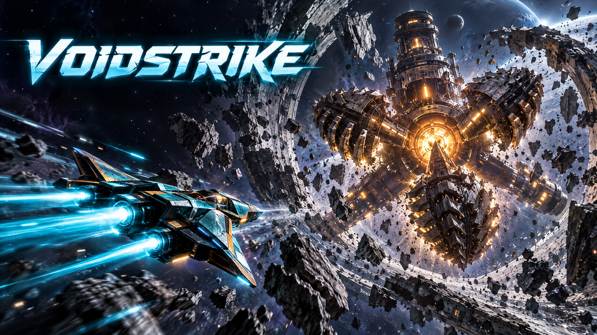

# VOIDSTRIKE — Shattered Ring Breakout



**VOIDSTRIKE** is a Three.js browser space shooter built from the Heliospur showcase. Fly an interceptor through a shattered planetary ring, chain kills, dodge enemy fire, and defeat **BOREWARDEN**, an autonomous deep-core mining platform, across three combat phases.

[Play VOIDSTRIKE](https://voidstrike-kg4srpnu.manus.game)

## Current version and status

- **Game/package version:** `0.2.0` (`package.json`; see [VERSION.md](VERSION.md)).
- **Campaign:** the original single-player on-rails mode remains intact, with local saves and local scores.
- **PvP source:** a separate, guest-accessible Free-Flight 1v1 mode and authoritative Node.js/WebSocket server are included, with server and client protocol tests.
- **PvP host:** no Render service has been created or deployed. The committed public bootstrap has a blank WSS address, so the live game clearly reports “server not configured” and will not fake an online match. Follow [server/README.md](server/README.md) if you choose to deploy it yourself.
- **Accounts and persistence:** player accounts/login, cloud saves, and a global online campaign leaderboard are deferred by the current request. This build keeps the existing local-only save and leaderboard; Manus-managed server and database remain disabled.
- **Language:** English-only player experience.

## Game modes

### Campaign

The original rail shooter remains the default experience: launch cinematic and tutorial, enemy formations, an asteroid-storm boost section, a checkpoint, and a three-phase BOREWARDEN boss. Campaign score history and progress remain browser-local.

### Free-Flight PvP

Fly freely in a bounded 3D arena, rather than along the campaign rail. Guest pilots create or join a six-character room code for a two-seat, first-to-five duel. The server owns movement, shots, hits, hull/shield, abilities, pickups, respawns, scores, and match outcomes. The client anticipates only the local ship and smooths server-authoritative snapshots for the opponent and shared objects.

The PvP room is temporary and held in server memory. Its room code is an invitation, not a player account. Reconnect tokens are temporary, room-scoped, and kept in tab-scoped browser storage. A server restart or Render Free spin-down can end a room; no durable identity or match state is promised.

## Aircraft Hangar

Aircraft choice is saved locally and reused by both modes.

| Class | Hull | Speed | Weapon | Ability |
| --- | ---: | ---: | --- | --- |
| **Wraith** — interceptor | 80 HP | 1.25× | Twin Pulse, paired shots | Afterburn: 2.5 s speed/fire-rate boost; 12 s cooldown |
| **Bulwark** — gunship | 140 HP | 0.78× | Siege Cannon, heavy shot | Aegis Field: 2.4 s damage immunity; 18 s cooldown |
| **Tempest** — striker | 100 HP | 1.00× | Triad Spread, three-shot fan | EMP Pulse clears nearby hostile PvP shots; 20 s cooldown |

Shared aircraft profiles are stored in `shared/aircraft-profiles.json` and consumed by the game and the authoritative server.

## Collectible power-ups

The campaign distributes a deterministic cycle of Health Cells, Shield Cells, and Weapons Uplinks. PvP pickups are server-spawned and server-awarded.

- **Health Cell:** restores 22 hull, up to the selected aircraft's maximum.
- **Shield Cell:** restores 30 shield, up to the 60-point cap.
- **Weapons Uplink:** for 8 seconds, increases shot damage by 35% and fire rate by 25%; collecting another refreshes the timer instead of stacking effects.

## Controls

### Campaign

| Action | Keyboard & mouse | Gamepad | Touch |
| --- | --- | --- | --- |
| Deploy from title | Space or **Deploy** button | A / Start | Tap **Deploy** |
| Steer | WASD / arrow keys | Left stick | Floating stick |
| Aim | Mouse | Right stick | Reticle ahead of the ship with aim assist |
| Fire | Left mouse button or J | RT / RB / A | **FIRE** |
| Aircraft ability | E | LB | — |
| Roll dodge | Space or K; right-click also rolls | LT / X | **ROLL** |
| Pause | Esc or P | Start | Pause button |

### Free-Flight PvP

| Action | Keyboard & mouse | Gamepad | Touch |
| --- | --- | --- | --- |
| Fly | WASD / arrows (forward, reverse, strafe) | Left stick | PvP flight stick |
| Climb / dive | R / F | D-pad up / down | Up / down zones |
| Aim | Mouse | Right stick | Drag on the right side |
| Fire | Hold left mouse or J | RT / RB / A | **FIRE** |
| Class ability | E | LB | **ABILITY** |
| Roll | Space / K / right-click | LT / X | **ROLL** |
| Leave room | Esc | B / Back | **LEAVE** |

## Audio and presentation

The title menu uses the user-supplied **Operation Cryo Intro** track, subject to browser audio-gesture rules and the saved volume/mute settings. Combat SFX are synthesized by the game. The user-provided MP3 is included in `assets/audio/`; the managed build loads it from the project storage route to avoid bundling the large track into static output.

A plain external clone does not have that project storage route. When running outside the managed game, point `menuMusicUrl` in `src/main.ts` to a local or hosted music copy. No storage credentials are included in this repository.

## Local development and tests

Developed with Node.js `22.13.0` and pnpm `10.18.0`.

```sh
pnpm install --frozen-lockfile
pnpm dev
pnpm typecheck
pnpm test
pnpm build
pnpm smoke
pnpm smoke:pvp
```

`pnpm test` runs the Vitest campaign/client suite and the standalone Node.js PvP server suite.
The browser smoke commands require Playwright's Chromium (`pnpm exec playwright install chromium`) once per machine. `pnpm smoke:pvp` runs a real two-browser local room against an ephemeral authoritative server, temporarily configures only the ignored production `dist/` copy, restores it afterward, and saves a match screenshot under `shots/`.

To test the host locally, start the server in another terminal:

```sh
npm --prefix server ci
npm --prefix server start
```

It listens on port `3000` by default. For a local duel only, temporarily set `signalingUrl` in `public/multiplayer/bootstrap.json` to `ws://localhost:3000/ws` while the Vite app runs on `http://localhost:5173`; restore the blank value before committing or publishing. Public hosts require `wss://`.

## User-managed Render deployment

`render.yaml` is a manual Free Web Service recipe, not an active service. It disables automatic deployment (`autoDeployTrigger: off`), so pushing source to GitHub does not deploy the PvP server. If you decide to host it, connect the private repository in Render and manually submit its Blueprint deployment. After Render supplies a real service host, configure the public `signalingUrl` in `public/multiplayer/bootstrap.json`, commit it, and verify `/healthz`, secure WSS, the origin allowlist, and two real browser clients. The server guide contains the exact steps and the [official free-tier caveats](server/RENDER_NOTES.md).

Render Free Web Services support WebSockets, but can sleep after 15 minutes without inbound activity and take about a minute to wake. They have ephemeral filesystems and no persistent disk attachment; PvP rooms live in memory and may end at restart, redeploy, or spin-down. Treat this as a hobby/experimental host, not a production availability guarantee.

## Project map

| Path | Responsibility |
| --- | --- |
| `src/engine/loop.ts`, `timeline.ts`, `impact.ts` | Fixed-step campaign simulation, reusable timelines, hit-stop, slow motion, shake, and impact effects |
| `src/engine/input.ts` | Keyboard, mouse, gamepad, and touch inputs, including separate flight axes |
| `src/engine/physics.ts`, `renderer.ts`, `pool.ts` | Rapier queries, Three.js rendering/quality tiers, and pooled objects |
| `src/engine/audio.ts`, `music.ts` | Audio mixer, synthesized effects, sequenced in-run score, and menu track loading |
| `src/engine/save.ts`, `i18n.ts` | Versioned local save, local leaderboard, and English strings |
| `src/game/` | Campaign mission, boss, enemies, aircraft, pickups, and `pvp/` client mode |
| `src/game/pvp/` | Versioned network protocol, WSS bootstrap validation, room session, and separate 3D arena scene |
| `server/src/` | Standalone Node.js authoritative room and WebSocket simulation |
| `server/test/`, `tests/pvp.test.ts` | Authoritative two-client/server tests and checked client protocol/config parsing |
| `shared/` | Aircraft and PvP simulation rules shared between browser and Node server |
| `scripts/pvp-browser-smoke.mjs` | Reproducible local two-browser room and authoritative flight-input smoke |
| `src/ui/`, `src/styles/main.css` | Title menu, Hangar, campaign UI, PvP lobby/match HUD, and responsive controls |
| `src/i18n/en.json` | Active player-facing text (English-only) |
| `render.yaml`, `server/README.md`, `server/RENDER_NOTES.md` | Manual hosting recipe, deployment guide, and official Render-source notes |
| `assets/audio/`, `assets/share/`, `public/fonts/` | Supplied soundtrack, sharing artwork, and bundled fonts |
| `plan.md`, `TODO.md`, `VERSION.md`, `CHANGELOG.md` | Implementation plan, tracked outcomes, and version history |

## Credits and licensing notes

The project began with the supplied Heliospur showcase source and assets. The title menu uses the user-supplied Operation Cryo Intro track; in-game effects are synthesized by the game. Bundled Sora, Figtree, and Noto Sans SC fonts include SIL Open Font License 1.1 notices in `public/fonts/`. Core dependencies include Three.js (MIT), Rapier (Apache-2.0), and the PvP server's `ws` package (MIT); full dependency versions are recorded in the lockfiles.

No project-level license has been declared. The presence of this private development source does not grant a new redistribution license for the supplied game assets or soundtrack; review the original source and asset terms before redistributing.
